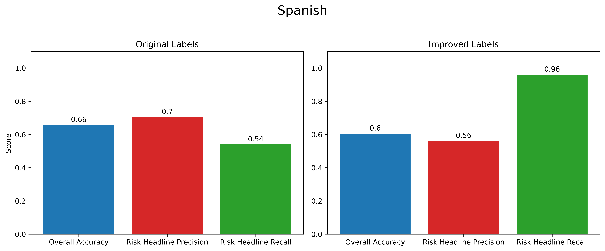

# Latin-Risk-Pulse-ML-model

Latin Risk Pulse is an organization seeking to better understand Latin American risks. This project trains a machine learning model to determine whether local Spanish and Portuguese headlines represent a potential political, security or economic risk. It uses a dataset of approximately 100K headlines.

## The data 🛢
The data was collected by scraping headline text from online news sources in Latin America. The texts were then put through a keyword matching process before being fed to Google Gemini for labelling. The risk labels include political stability risks, security and violence risks, and economic and regulatory risks.

 

## 01: Data exploration 🔍
The data shows a few imbalances, most notably in risk vs non-risk headlines.  
[See notebook.](Notebooks/01_data_exploration.ipynb)

 

## 02: Baseline model 🚀
A TF-IDF logistic regression model shows extremely low performance on risk headline recall, the main objective of this project. This is likely because the keyword matching process missed many risk headlines, resulting in many false negatives in the data.  
[See notebook.](Notebooks/02_tfidf_baseline.ipynb)

#### Spanish

<pre>
               precision    recall  f1-score   support

           0       0.92      0.99     0.95     13235
           1       0.84      0.44     0.58      2039

    accuracy                           0.91     15274
   macro avg       0.88      0.71      0.76     15274
weighted avg       0.91      0.91      0.90     15274
</pre>

#### Portuguese

<pre>
               precision    recall  f1-score   support

           0       0.84      0.98      0.91      2558
           1       0.83      0.38      0.52       751

    accuracy                           0.84      3309
   macro avg       0.84      0.68      0.71      3309
weighted avg       0.84      0.84      0.82      3309
</pre>

 

## 03: Improve labels 🏷️
Training a model an half of the data at a time and using it to predict the other half's non-risk headlines improves risk headline recall dramatically (likely because of fewer false negatives). However, overall accuracy has also suffered.  
[See notebook.](Notebooks/03_improve_label_quality.ipynb)

 

 

## 04: Balance risk types ⚖️
Balancing the risk types by taking an equal random sample from each category (political, security, economic) improves overall accuracy, presumably because the model is better able to distinguish between unrepresented risks and non-risk headlines.   
[See notebook.](Notebooks/04_balance_risk_types.ipynb)

