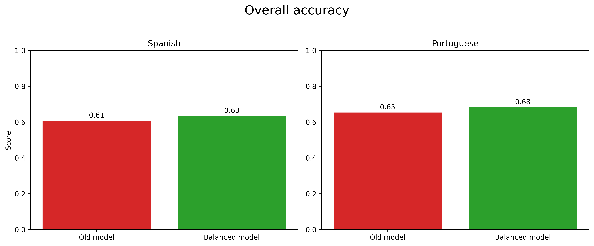
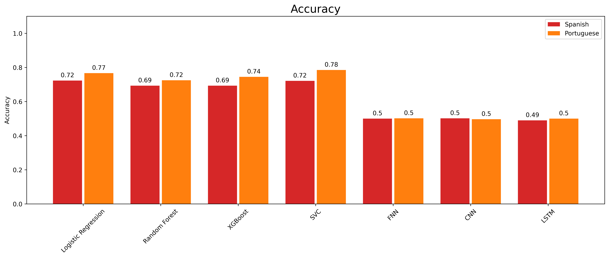

# Latin-Risk-Pulse-ML-model

Latin Risk Pulse is a project seeking to better understand Latin American risks. This repository trains machine learning models to classify whether regional headlines constitute a potential political, security or economic risk.

## The data 🛢
### The 1st dataset
An initial dataset of over 100,000 headlines was collected by scraping headline text from online news sources in Argentina, Brazil, Colombia and Mexico. The texts were then put through a keyword matching process before being fed to Google Gemini for labelling.  

Because the keyword matching process likely missed many risk headlines however, the default non-risk category probably contains a number of false positives. This was initially tackled by training a model on half the data, predicting the other half's non-risk headlines and keeping only those with low scores.   

But the result was a skewed dataset that doesn't reflect the real distribution. This became particularly evident during parameter tuning when tuned models actually performed worse than their default counterparts on put aside data, prompting the need for a second, better data collection process.    

### The 2nd dataset (collection in progress)
A second dataset is currenty being collected in which all headlines are fed to Google Gemini for labelling according to a more clearly defined criteria with multiple examples. This however requires a greater number of API calls, meaning this dataset will initially focus only on Colombia with a view to include other countries later if it is a success. 

 

## The 1st dataset

### 01: Explore data 🔍
The data shows a few imbalances, most notably in risk vs non-risk headlines.  
[See notebook.](Notebooks/01_data_exploration.ipynb)

 

### 02: Establish baseline 🚀
A TF-IDF logistic regression model shows very poor performance on the main objective of this project, risk headline recall. This is likely because keyword matching missed risk headlines, resulting in false negatives.  
[See notebook.](Notebooks/02_tfidf_baseline.ipynb)

#### Spanish results

<pre>
               precision    recall  f1-score   support

           0       0.92      0.99     0.95     13235
           1       0.84      0.44     0.58      2039

    accuracy                           0.91     15274
   macro avg       0.88      0.71      0.76     15274
weighted avg       0.91      0.91      0.90     15274
</pre>

#### Portuguese results

<pre>
               precision    recall  f1-score   support

           0       0.84      0.98      0.91      2558
           1       0.83      0.38      0.52       751

    accuracy                           0.84      3309
   macro avg       0.84      0.68      0.71      3309
weighted avg       0.84      0.84      0.82      3309
</pre>

 

### 03: Improve labels 🏷️
Training a model on half the data and using it to predict the other half's non-risk headlines allows many false negatives to be removed based on their probability score, improving risk headline recall dramatically.   
[See notebook.](Notebooks/03_improve_labels.ipynb)

#### Results

 

 

### 04: Balance risk types ⚖️
Taking a balanced sample from each risk type (political, security and economic) appears to increase accuracy by a few percentage points, likely because it improves the model's ability to distinguish underrepresented risk types.   
[See notebook.](Notebooks/04_balance_risk_types.ipynb)

#### Risk type imbalances

<pre>
*** Spanish ***
                        k      %
risk_type                       
security_violence    3.18  14.99
political_stability  2.13  10.04
economic_regulatory  1.96   9.24

*** Portuguese ***
                        k      %
risk_type                       
political_stability  1.18  19.58
economic_regulatory  0.77  12.78
security_violence    0.71  11.78
</pre>

#### Results

 

### 05: Single out risk types 🧐

Focusing on different risk types individually appears to improve accuracy significantly compared to combining all three into one category, suggesting three specialized models are better than a single general one.    
[See notebook.](Notebooks/05_focused_risk_types.ipynb)

#### Spanish results

#### Portuguese results

 

### 06: Select model 🛠️

A support vector machine (SVM) trained on TF-IDF vectors seems to be the most promising model, especially given that the more complex neural network models are overfitting on this relativley small, noisy dataset.  
[See notebook.](Notebooks/06_model_selection.ipynb)

#### Model accuracies

#### Training vs. validation gap for neural networks

<pre>
Spanish:

Model      Training acc.        Validation acc.
--------------------------------------------------
FNN        0.98                 0.32                
CNN        1.0                  0.28                
LSTM       1.0                  0.31                

Portuguese:

Model      Training acc.        Validation acc.
--------------------------------------------------
FNN        0.97                 0.27                
CNN        1.0                  0.2                 
LSTM       1.0                  0.26                             
</pre>

 

### 07: Parameter tuning 🎚️

 

## The 2nd dataset (collection in progress)

A second round of experimentation will begin once a new dataset of over 50,000 headlines has been collected using an improved data collection method. 

 
