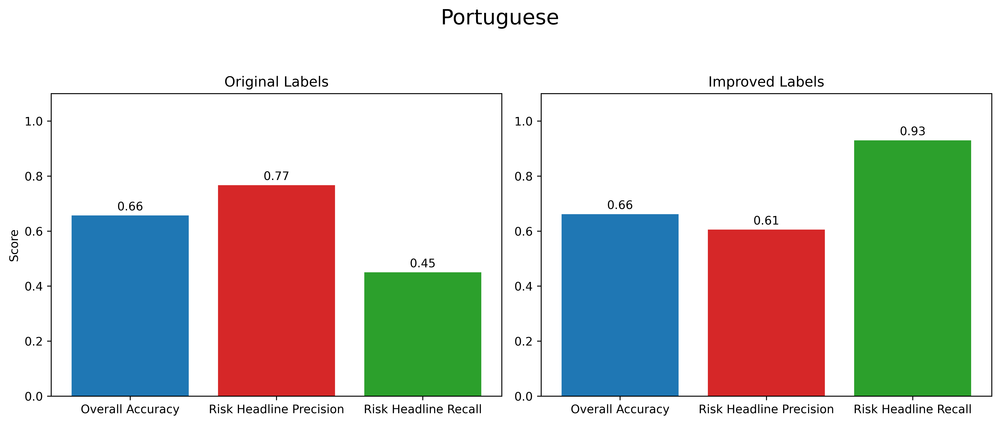
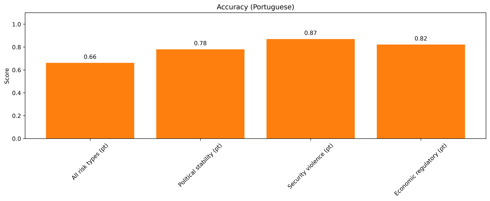

# Latin-Risk-Pulse-ML-model

Latin Risk Pulse is a project seeking to better understand Latin American risks. This repository trains a machine learning model to determine whether Spanish and Portuguese headlines represent a potential political, security or economic risk. It uses a raw dataset of over 100K headlines.

## The data 🛢
The data was collected by scraping headline text from online news sources in Latin America. The texts were then put through a keyword matching process before being fed to Google Gemini for labelling. The risk labels include 1) political stability, 2) security and violence, and 3) economic and regulatory risks.

 

## 01: Explore data 🔍
The data shows a few imbalances, most notably in risk vs non-risk headlines.  
[See notebook.](Notebooks/01_data_exploration.ipynb)

 

## 02: Establish baseline 🚀
A TF-IDF logistic regression model shows very poor performance on the main objective of this project, risk headline recall. This is likely because keyword matching missed many risk headlines, resulting in false negatives.  
[See notebook.](Notebooks/02_tfidf_baseline.ipynb)

#### Spanish results

<pre>
               precision    recall  f1-score   support

           0       0.92      0.99     0.95     13235
           1       0.84      0.44     0.58      2039

    accuracy                           0.91     15274
   macro avg       0.88      0.71      0.76     15274
weighted avg       0.91      0.91      0.90     15274
</pre>

#### Portuguese results

<pre>
               precision    recall  f1-score   support

           0       0.84      0.98      0.91      2558
           1       0.83      0.38      0.52       751

    accuracy                           0.84      3309
   macro avg       0.84      0.68      0.71      3309
weighted avg       0.84      0.84      0.82      3309
</pre>

 

## 03: Improve labels 🏷️
Training a model on half the data at a time and using it to predict the other half's non-risk headlines allows many false negatives to be removed based on their probability score, improving risk headline recall dramatically.   
[See notebook.](Notebooks/03_improve_labels.ipynb)

#### Results

 

 

## 04: Balance risk types ⚖️
Taking a balanced sample from each risk type (political, security and economic) appears to increase accuracy by a few percentage points, likely because it improves the model's ability to distinguish underrepresented risk types.   
[See notebook.](Notebooks/04_balance_risk_types.ipynb)

#### Risk type imbalances

<pre>
*** Spanish ***
                        k      %
risk_type                       
security_violence    3.18  14.99
political_stability  2.13  10.04
economic_regulatory  1.96   9.24

*** Portuguese ***
                        k      %
risk_type                       
political_stability  1.18  19.58
economic_regulatory  0.77  12.78
security_violence    0.71  11.78
</pre>

#### Results

 

## 05: Focus risk types 🧐

Focusing on the different risk types individually appears to improve accuracy significantly compared to training a single model combining all 3 into one category, suggesting 3 specialized models are better than 1 general model.    
[See notebook.](Notebooks/05_focused_risk_types.ipynb)

#### Spanish results

#### Portuguese results

 

## 06: Select model 🛠️

An XGBoost model trained on TF-IDF vectors seems to be the promising strategy for this dataset, especially given that the more complex neural network models trained on embeddings appear to result in overfitting.    
[See notebook.](Notebooks/06_model_selection.ipynb)

#### Model accuracies

#### Training vs. validation gap for neural networks

<pre>
Spanish:

Model      Training acc.        Validation acc.
--------------------------------------------------
FNN        0.98                 0.25                
CNN        1.0                  0.24                
LSTM       0.99                 0.34                

Portuguese:

Model      Training acc.        Validation acc.
--------------------------------------------------
FNN        0.98                 0.26                
CNN        1.0                  0.13                
LSTM       1.0                  0.23                
</pre>

 

## 07: Parameter tuning 🎚️

